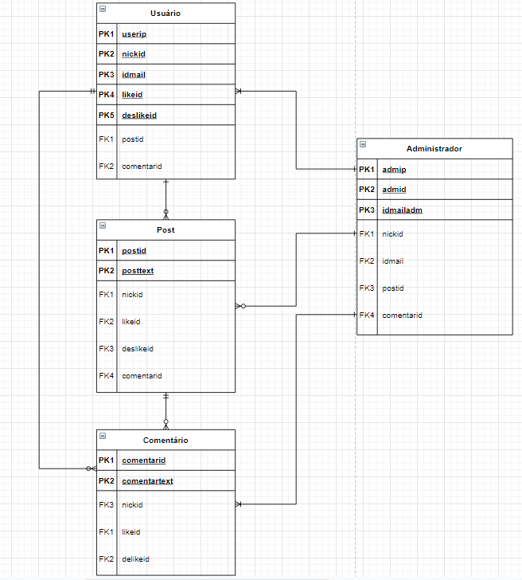

# PROJETO HORIZON

**Integrantes:**
 - Jhuan Robert Jesus dos Santos
 - Henrique Silva de Oliveira
 - Matheus Souza do Nascimento

 ## Descrição do Projeto

  Como amantes da Astronomia (ciência que estuda todos os corpos celestes do Universo), nosso grupo decidiu criar uma rede social onde todos os que gostam dessa área, possam discutir entre si sobre ideias e teorias baseadas em estudos e análises autônomas ou em teorias famosas, como a teoria da relatividade geral, e com isso possam encontrar uma resposta definitiva ou pelo menos chegar o mais próximo possível desta.

A proposta HORIZON é unir pesquisadores e admiradores da Astronomia e até mesmo de seus ramos, como a Astrofísica, a Cosmologia, a Astronomia planetária e a Astrobiologia, para trazer discussões, fatos, dúvidas e assuntos sobre o tema proposto.

## Documentação

- [Manual do Usuário](manual.md)
- [Requisitos](requisitos.md)
- [Casos de Uso](casos-de-uso.md)
- [Apresentação](apresentacao.pdf)

**Modelagem do Banco de Dados**

