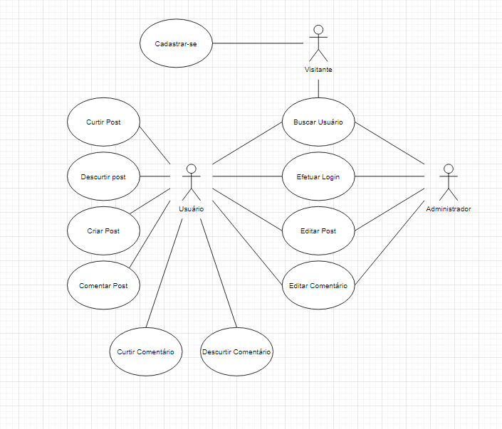

# Documento de Casos de Uso

## Lista dos Casos de Uso

 - [CDU 01](#CDU-01): Efetuar login.
 - [CDU 02](#CDU-02): Cadastrar-se
 - [CDU 03](#CDU-03): Criar post.
 - [CDU 04](#CDU-04): Editar post.
 - [CDU 05](#CDU-05): Comentar em post.
 - [CDU 06](#CDU-06): Editar comentário de post.
 - [CDU 07](#CDU-07): Curtir post.
 - [CDU 08](#CDU-08): Descurtir post.
 - [CDU 09](#CDU-09): Curtir comentário.
 - [CDU 10](#CDU-10): Descurtir comentário.
 - [CDU 11](#CDU-11): Buscar perfil de usuário.
 - [CDU 12](#CDU-12): Excluir Postagem(Usuário Autor).
 - [CDU 13](#CDU-13): Excluir Postagem(Administrador).
 - [CDU 14](#CDU-14): Excluir Comentário(Usuário Autor).
 - [CDU 15](#CDU-15): Excluir Comentário(Administrador).
 - [CDU 16](#CDU-16): Excluir Usuário(Administrador).
 - [CDU 17](#CDU-17): Excluir o Perfil Próprio.

## Lista dos Atores

 - Visitante
 - Usuário
 - Administrador

## Diagrama de Casos de Uso

## Descrição dos Casos de Uso

### CDU 01

Efetuar Login

**Fluxo Principal**

1. O sistema mostra um formulário com os campos login e senha.
2. O usuário insere seu login e senha e clica no botão "Acessar".
3. O sistema valida o login e a senha do usuário.
4. O sistema redireciona o usuário para a tela inicial.

**Fluxo Alternativo A**

1. O sistema mostra um formulário com os campos login e senha.
2. O usuário insere seu login e senha e clica no botão "Acessar".
3. O sistema informa que o login ou senha não coincidem.
4. O usuário corrige as informações de login e senha e clica no botão "Acessar".
5. O sistema redireciona o usuário para a tela inicial.

**Fluxo Alternativo B**

1. O sistema mostra um formulário com os campos login e senha.
2. O visitante clica no botão "Cadastre-se".
3. O sistema redireciona o visitante para o formulário de cadastro.
4. O sistema mostra um formulário com os campos nickname, e-mail, senha e confirmação de senha.
5. O visitante insere seu nickname, e-mail, senha e confirma sua senha.
6. O visitante faz upload de uma imagem para identificação(fluxo opcional).
7. O visitante clica no botão "Cadastrar".
8. O sistema armazena os dados do visitante e informa ao novo usuário que o cadastro foi realizado.
9. O sistema redireciona o novo usuário para a tela inicial.

### CDU 02

Cadastrar-se

**Fluxo Principal**

1. O sistema mostra um formulário com os campos nickname, e-mail, senha e confirmação de senha.
2. O visitante insere seu nickname, e-mail, senha e confirma sua senha.
3. O visitante faz upload de uma imagem para identificação(fluxo opcional).
4. O visitante clica no botão "Cadastrar".
5. O sistema armazena os dados do visitante e informa ao novo usuário que o cadastro foi realizado.
6. O sistema redireciona o novo usuário para a tela inicial.

**Fluxo Alternativo A**

1. O sistema mostra um formulário com os campos nickname, e-mail, senha e confirmação de senha.
2. O visitante insere seu nickname, e-mail, senha e confirma sua senha.
3. O visitante faz upload de uma imagem para identificação(fluxo opcional).
4. O visitante clica no botão "Cadastrar".
5. O sistema informa que o e-mail não é válido ou que já está sendo usado.
6. O visitante corrige o e-mail e clica no botão "Cadastrar".
7. O sistema armazena os dados do visitante e informa ao novo usuário que o cadastro foi realizado.
8. O sistema redireciona o novo usuário para a tela inicial.

**Fluxo Alternativo B**

1. O sistema mostra um formulário com os campos nickname, e-mail, senha e confirmação de senha.
2. O visitante insere seu nickname, e-mail, senha e confirma sua senha.
3. O visitante faz upload de uma imagem para identificação(fluxo opcional).
4. O visitante clica no botão "Cadastrar".
5. O sistema informa que o nickname não é válido pois já está sendo usado.
6. O visitante corrige o nickname e clica no botão "Cadastrar".
7. O sistema armazena os dados do visitante e informa ao novo usuário que o cadastro foi realizado.
8. O sistema redireciona o novo usuário para a tela inicial.

### CDU 03

Criar Post

**Fluxo Principal**

1. O sistema mostra um formulário com um campo de texto e um campo para criação de tags.
2. O usuário insere sua resposta no campo de texto.
3. O usuário cria uma ou mais tags para seu post.
4. O usuário clica no botão "Enviar post".
5. O sistema pede para o usuário confirmar o envio do post.
6. O usuário clica no botão "Confirmar".
7. O sistema registra o post, informa que o post foi enviado e retorna para a tela principal.

**Fluxo Alternativo A**

1. O sistema mostra um formulário com um campo de texto e um campo para criação de tags.
2. O usuário insere sua resposta no campo de texto.
3. O usuário cria uma ou mais tags para seu post.
4. O usuário clica no botão “Enviar post”.
5. O sistema informa que o campo de texto excedeu o limite de caracteres.
6. O usuário corrige o campo de texto e clica no botão "Enviar post".
7. O sistema pede para o usuário confirmar o envio do post.
8. O usuário clica no botão “Confirmar”.
9. O sistema registra o post, informa que o post foi enviado e retorna para a tela principal.

**Fluxo Alternativo B**

1. O sistema mostra um formulário com um campo de texto e um campo para criação de tags.
2. O usuário não insere uma resposta no campo de texto nem cria tags para o post.
3. O usuário clica no botão "Enviar post".
4. O sistema informa que o post está em branco e redireciona o usuário de volta ao formulário de post.
5. O usuário insere uma resposta no campo de texto.
6. O usuário cria uma ou mais tags para seu post.
7. O usuário clica no botão "Enviar post".
8. O sistema pede para o usuário confirmar o envio do post.
9. O usuário clica em "Confirmar".
10. O sistema registra o post, informa que o post foi enviado e retorna para a tela principal.

**Fluxo Alternativo C**

1. O sistema mostra um formulário com um campo de texto e um campo para criação de tags.
2. O usuário insere sua resposta no campo de texto.
3. O usuário cria uma ou mais tags para seu post.
4. O usuário clica no botão “Enviar post”.
5. O sistema informa que uma ou mais das tags inseridas são inválidas.
6. O usuário edita as tags do post e clica no botão “Enviar post”.
7. O sistema pede para o usuário confirmar o envio do post.
8. O usuário clica no botão “Confirmar”.
9. O sistema registra o post, informa que o post foi enviado e retorna para a tela principal.

**Fluxo Alternativo D**

1. O sistema mostra um formulário com um campo de texto e um campo para criação de tags.
2. O usuário insere sua resposta no campo de texto.
3. O usuário cria uma ou mais tags para seu post.
4. O usuário clica no botão “Enviar post”.
5. O sistema informa que há uma ou mais tags repetidas.
6. O usuário edita as tags do post e clica no botão “Enviar post”.
7. O sistema pede para o usuário confirmar o envio do post.
8. O usuário clica no botão “Confirmar”.
9. O sistema registra o post, informa que o post foi enviado e retorna para a tela principal.

### CDU 04

Editar Post

**Fluxo Principal**

1. O sistema mostra um formulário com um campo de texto.
2. O usuário insere sua resposta no campo de texto.
3. O usuário clica no botão "Editar post".
4. O sistema pede para o usuário confirmar a edição do post.
5. O usuário clica no botão "Confirmar".
6. O sistema registra a edição do post, informa que o mesmo foi editado e retorna para a área do post.

**Fluxo Alternativo A**

1. O sistema mostra um formulário com um campo de texto.
2. O usuário insere sua resposta no campo de texto.
3. O usuário clica no botão "Editar post".
4. O sistema informa que o usuário excedeu o número de caracteres e retorna para o campo de texto.
5. O usuário insere sua resposta no campo de texto.
6. O usuário clica no botão "Editar post".
7. O sistema pede para o usuário confirmar a edição do post.
8. O usuário clica no botão "Confirmar".
9. O sistema registra a edição do post, informa que o mesmo foi editado e retorna para a área do post.

**Fluxo Alternativo B**

1. O sistema mostra um formulário com um campo de texto.
2. O usuário não insere sua resposta no campo de texto.
3. O usuário clica no botão "Editar post".
4. O sistema informa que o post está em branco e redireciona o usuário de volta ao formulário de post.
5. O usuário insere uma resposta no campo de texto.
6. O usuário clica no botão "Editar post".
7. O sistema pede para o usuário confirmar o envio do post.
8. O usuário clica em "Confirmar".
9. O sistema registra a edição do post, informa que o mesmo foi editado e retorna para a área do post.

### CDU 05

Comentar em Post

**Fluxo Principal**

1. O sistema mostra um formulário com um campo de texto.
2. O usuário insere sua resposta no campo de texto.
3. O usuário clica no botão "Comentar".
4. O sistema pede para o usuário confirmar o envio do comentário.
5. O usuário clica no botão "Confirmar".
6. O sistema registra o comentário, informa que o mesmo foi enviado e retorna para o post que foi comentado.

**Fluxo Alternativo A**

1. O sistema mostra um formulário com um campo de texto.
2. O usuário insere sua resposta no campo de texto.
3. O usuário clica no botão "Comentar".
4. O sistema informa que o usuário excedeu o número de caracteres e retorna para o campo de texto.
5. O usuário insere sua resposta no campo de texto.
6. O usuário clica no botão "Comentar".
7. O sistema pede para o usuário confirmar o envio do comentário.
8. O usuário clica no botão "Confirmar".
6. O sistema registra o comentário, informa que o mesmo foi enviado e retorna para o post que foi comentado.

**Fluxo Alternativo B**

1. O sistema mostra um formulário com um campo de texto.
2. O usuário não insere sua resposta no campo de texto.
3. O usuário clica no botão "Comentar".
4. O sistema informa que o comentário está em branco e redireciona o usuário de volta ao formulário de comentário.
5. O usuário insere uma resposta no campo de texto.
6. O usuário clica no botão "Comentar".
7. O sistema pede para o usuário confirmar o envio do comentário.
8. O usuário clica em "Confirmar".
9. O sistema registra o post, informa que o comentário foi enviado e retorna para o post que foi comentado.

### CDU 06

Editar Comentário em Post

**Fluxo Principal**

1. O sistema mostra um formulário com um campo de texto.
2. O usuário insere sua resposta no campo de texto.
3. O usuário clica no botão "Editar comentário".
4. O sistema pede para o usuário confirmar a edição do comentário.
5. O usuário clica no botão "Confirmar".
6. O sistema registra a edição do comentário, informa que o mesmo foi enviado e retorna para o post que foi comentado.

**Fluxo Alternativo A**

1. O sistema mostra um formulário com um campo de texto.
2. O usuário insere sua resposta no campo de texto.
3. O usuário clica no botão "Editar comentário".
4. O sistema informa que o usuário excedeu o número de caracteres e retorna para o campo de texto.
5. O usuário insere sua resposta no campo de texto.
6. O usuário clica no botão "Editar comentário".
7. O sistema pede para o usuário confirmar a edição do comentário.
8. O usuário clica no botão "Confirmar".
9. O sistema registra a edição do comentário, informa que o mesmo foi enviado e retorna para o post que foi comentado.

**Fluxo Alternativo B**

1. O sistema mostra um formulário com um campo de texto.
2. O usuário não insere sua resposta no campo de texto.
3. O usuário clica no botão "Editar comentário".
4. O sistema informa que o comentário está em branco e redireciona o usuário de volta ao formulário de comentário.
5. O usuário insere uma resposta no campo de texto.
6. O usuário clica no botão "Comentar".
7. O sistema pede para o usuário confirmar a edição do comentário.
8. O usuário clica em "Confirmar".
9. O sistema registra a edição do comentário, informa que o mesmo foi enviado e retorna para o post que foi comentado.

### CDU 07

Curtir Post

**Fluxo Principal**

1. O sistema mostra um ícone clicável na área do post para curtir.
2. O usuário clica no ícone.
3. O sistema registra a curtida, muda o ícone de curtida e informa ao usuário.

**Fluxo Alternativo A**

1. O sistema mostra um ícone clicável na área do post para curtir.
2. O visitante clica no ícone.
3. O sistema informa que ele precisa estar logado para interagir.
4. O visitante clica em "Logar".
5. O sistema redireciona o visitante para a tela de login.

**Fluxo Alternativo B**

1. O sistema mostra um ícone clicável na área do post para curtir.
2. O usuário clica no ícone.
3. O sistema detecta que o post já foi curtido pelo usuário.
4. O sistema remove a curtida do registro, muda o ícone de curtida e informa ao usuário.

**Fluxo Alternativo C**

1. O sistema mostra um ícone clicável na área do post para curtir.
2. O usuário clica no ícone.
3. O sistema detecta que o post já foi descurtido pelo usuário.
4. O sistema remove a descurtida do registro, registra a curtida, muda o ícone de descurtida, muda o ícone de curtida e informa ao usuário.

### CDU 08

Descurtir Post

**Fluxo Principal**

1. O sistema mostra um ícone clicável na área do post para descurtir.
2. O usuário clica no ícone.
3. O sistema registra a descurtida, muda o ícone de descurtida e informa ao usuário.

**Fluxo Alternativo A**

1. O sistema mostra um ícone clicável na área do post para descurtir.
2. O visitante clica no ícone.
3. O sistema informa que ele precisa estar logado para interagir.
4. O visitante clica em "Logar".
5. O sistema o redireciona para a área de login.

**Fluxo Alternativo B**

1. O sistema mostra um ícone clicável na área do post para descurtir.
2. O usuário clica no ícone.
3. O sistema detecta que o post já foi descurtido pelo usuário.
4. O sistema remove a descurtida do registro e informa ao usuário.

**Fluxo Alternativo C**

1. O sistema mostra um ícone clicável na área do post para descurtir.
2. O usuário clica no ícone.
3. O sistema detecta que o post já foi curtido pelo usuário.
4. O sistema remove a curtida do registro, registra a descurtida, muda o ícone de curtida, muda o símbolo de descurtida e informa ao usuário.

### CDU 09

Curtir Comentário

**Fluxo Principal**

1. O sistema mostra um ícone clicável na área do comentário para curtir.
2. O usuário clica no ícone.
3. O sistema registra a curtida, muda o ícone de curtida e informa ao usuário.

**Fluxo Alternativo A**

1. O sistema mostra um ícone clicável na área do comentário para curtir.
2. O visitante clica no ícone.
3. O sistema informa que ele precisa estar logado para interagir.
4. O visitante clica em "Logar".
5. O sistema o redireciona para a área de login.

**Fluxo Alternativo B**

1. O sistema mostra um ícone clicável na área do comentário para curtir.
2. O usuário clica no ícone.
3. O sistema detecta que o comentário já foi curtido pelo usuário.
4. O sistema remove a curtida do registro e informa ao usuário.

**Fluxo Alternativo C**

1. O sistema mostra um ícone clicável na área do comentário para curtir.
2. O usuário clica no ícone.
3. O sistema detecta que o comentário foi descurtido pelo usuário.
4. O sistema remove a descurtida do registro, registra a curtida, muda o ícone de curtida, muda o ícone de descurtida e informa ao usuário.

### CDU 10

Descurtir Comentário

**Fluxo Principal**

1. O sistema mostra um ícone clicável na área do comentário para descurtir.
2. O usuário clica no ícone.
3. O sistema registra a descurtida, muda o ícone de descurtida e informa ao usuário.

**Fluxo Alternativo A**

1. O sistema mostra um ícone clicável na área do comentário para descurtir.
2. O visitante clica no ícone.
3. O sistema informa que ele precisa estar logado para interagir.
4. O visitante clica em "Logar".
5. O sistema o redireciona para a área de login.

**Fluxo Alternativo B**

1. O sistema mostra um ícone clicável na área do comentário para descurtir.
2. O usuário clica no ícone.
3. O sistema detecta que o comentário já foi descurtido pelo usuário.
4. O sistema remove a descurtida do registro e informa ao usuário.

**Fluxo Alternativo C**

1. O sistema mostra um ícone clicável na área do comentário para descurtir.
2. O usuário clica no ícone.
3. O sistema detecta que o comentário foi curtido pelo usuário.
4. O sistema remove a curtida do registro, registra a descurtida, muda o ícone de curtida, muda o ícone de descurtida e informa ao usuário.

### CDU 11

Buscar Perfil de Usuário

**Fluxo Principal**

1. O sistema mostra um formulário com um campo de texto.
2. O usuário insere sua pesquisa no campo de texto.
3. O usuário clica no botão "Pesquisar".
4. O sistema registra a resposta do usuário.
5. O sistema procura registros compatíveis com a resposta do usuário.
6. O sistema redireciona o usuário para o resultado da pesquisa inicial.

**Fluxo Alternativo A**

1. O sistema mostra um formulário com um campo de texto.
2. O usuário insere sua pesquisa no campo de texto.
3. O usuário clica no botão “Pesquisar”.
4. O sistema informa que o usuário excedeu o limite de caracteres do campo de texto.
5. O usuário clica em “Ok”.
6. O sistema retorna ele até o campo de texto.

**Fluxo Alternativo B**

1. O sistema mostra um formulário com um campo de texto.
2. O usuário não insere nada no campo de texto.
3. O usuário clica no botão “Pesquisar”.
4. O sistema informa que o usuário não digitou nada.
5. O usuário clica em “Ok”.
6. O sistema retorna ele até o campo de texto.

**Fluxo Alternativo C**

1. O sistema mostra um formulário com um campo de texto.
2. O usuário insere sua pesquisa no campo de texto.
3. O usuário clica no botão “Pesquisar”.
4. O sistema registra a resposta do usuário.
5. O sistema procura registros compatíveis com a resposta do usuário.
6. O sistema informa que não há nenhum resultado correspondente.
7. O usuário clica em “Ok”.
8. O sistema retorna ele até o campo de texto.

### CDU 12

Excluir Postagem(Usuário Autor)

**Fluxo Principal**

1. O sistema apresenta nad postagens um botão para excluí-las, este botão só é visível para o usuário responsável pelas postagens e para os Administradores.
2. O usuário clica no botão.
3. O sistema pede para ele confirmar a exclusão.
4. O usuário confirma.
5. O sistema exclui a postagem do banco de dados.
6. O sistema dá um retorno ao usuário confirmando a exclusão.
7. O usuário clica em “ok”.
8. Ele é levado de volta à timeline.

**Fluxo Alternativo A**

1. O sistema apresenta nas postagens um botão para excluí-las, este botão só é visível para o usuário responsável pelas postagens para os administradores.
2. O usuário clica no botão.
3. O sistema pede para ele confirmar a exclusão.
4. O usuário confirma.
5. Ocorre um erro durante a exclusão da postagem.
6. O sistema dá um retorno informando do erro e oferece as opções de “cancelar” e “tentar novamente”.
7. O usuário opta por cancelar.
8. Ele é levado de volta à timeline.

**Fluxo Alternativo B**

1. O sistema apresenta nas postagens um botão para excluí-las, este botão só é visível para o usuário responsável pelas postagens para os administradores.
2. O usuário clica no botão.
3. O sistema pede para ele confirmar a exclusão.
4. O usuário confirma.
5. Ocorre um erro durante a exclusão da postagem.
6. O sistema dá um retorno informando do erro e oferece as opções de “cancelar” e “tentar novamente” .
7. O usuário opta por tentar novamente.
8. O sistema exclui a postagem.
9. O sistema dá um retorno informando do sucesso na exclusão.
10. O usuário clica em “ok”.
11. Ele é levado de volta à timeline.

**Fluxo Alternativo C**

1. O sistema apresenta nas postagens um botão para excluí-las, este botão só é visível para o usuário responsável pelas postagens para os administradores.
2. O usuário clica no botão.
3. O sistema pede para ele confirmar a exclusão.
4. O usuário confirma.
5. Ocorre um erro durante a exclusão da postagem.
6. O sistema dá um retorno informando do erro e oferece as opções de “cancelar” e “tentar novamente”.
7. O usuário opta por tentar novamente.
8. Ocorre outro erro no processo de exclusão.
9. O sistema exibe novamente as opções de “cancelar” e “tentar novamente”.

### CDU 13

Excluir Postagem(Administrador)

**Fluxo Principal**

1. O Administrador verifica uma postagem que viola uma ou mais diretrizes da comunidade.
2. O sistema apresenta na postagem um botão para excluí-la, este botão só é visível para o usuário responsável pela postagem e para os Administradores.
3. O Administrador clica no botão.
4. O sistema pede para ele confirmar a exclusão.
5. O Administrador confirma.
6. O sistema exclui a postagem do banco de dados.
7. O sistema dá um retorno ao Administrador confirmando a exclusão.
8. O Administrador clica em “ok”.
9. Ele é levado de volta à timeline.

**Fluxo Alternativo A**

1. O Administrador verifica uma postagem que viola uma ou mais diretrizes da comunidade.
2. O sistema apresenta na postagem um botão para excluí-lo, este botão só é visível para o usuário responsável pela postagem para os Administradores.
3. O Administrador clica no botão.
4. O sistema pede para ele confirmar a exclusão.
5. O Administrador confirma.
6. Ocorre um erro durante a exclusão da postagem.
7. O sistema dá um retorno informando do erro e oferece as opções de “cancelar” e “tentar novamente”.
8. O Administrador opta por cancelar.
9. Ele é levado de volta à timeline.

**Fluxo Alternativo B**

1. O Administrador verifica uma postagem que viola uma ou mais diretrizes da comunidade.
2. O sistema apresenta na postagem um botão para excluí-lo, este botão só é visível para o usuário responsável pela postagem para os Administradores.
3. O Administrador clica no botão.
4. O sistema pede para ele confirmar a exclusão.
5. O Administrador confirma.
6. Ocorre um erro durante a exclusão da postagem.
7. O sistema dá um retorno informando do erro e oferece as opções de “cancelar” e “tentar novamente”.
8. O Administrador opta por tentar novamente.
9. O sistema exclui a postagem.
10. O sistema dá um retorno informando do sucesso na exclusão.
11. O Administrador clica em “ok”.
12. Ele é levado de volta à timeline.

**Fluxo Alternativo C**

1. O Administrador verifica uma postagem que viola uma ou mais diretrizes da comunidade.
2. O sistema apresenta na postagem um botão para excluí-lo, este botão só é visível para o usuário responsável pela postagem para os Administradores.
3. O Administrador clica no botão.
4. O sistema pede para ele confirmar a exclusão.
5. O Administrador confirma.
6. Ocorre um erro durante a exclusão da postagem.
7. O sistema dá um retorno informando do erro e oferece as opções de “cancelar” e “tentar novamente”.
8. O Administrador opta por tentar novamente.
9. Ocorre outro erro no processo de exclusão.
10. O sistema exibe novamente as opções de “cancelar” e “tentar novamente”.
11. O Administrador opta por cancelar.
12. O sistema redireciona o Administrador para a timeline.

### CDU 14

Excluir Comentário(Usuário Autor).

**Fluxo Principal**

1. O sistema apresenta nos comentários um botão para excluí-los, este botão só é visível para o usuário responsável pelos comentários e para os administradores.
2. O usuário clica no botão.
3. O sistema pede para ele confirmar a exclusão.
4. O usuário confirma.
5. O sistema exclui o comentário do banco de dados.
6. O sistema dá um retorno ao usuário confirmando a exclusão.
7. O usuário clica em “ok”.
8. Ele é levado de volta aos comentários da postagem.

**Fluxo Alternativo A**

1. O sistema apresenta nos comentários um botão para excluí-los, este botão só é visível para o usuário responsável pelos comentários e para os administradores.
2. O usuário clica no botão.
3. O sistema pede para ele confirmar a exclusão.
4. O usuário confirma.
5. Ocorre um erro durante a exclusão da postagem.
6. O sistema dá um retorno informando do erro e oferece as opções de “cancelar” e “tentar novamente” .
7. O usuário opta por cancelar.
8. Ele é levado de volta aos comentários da postagem.

**Fluxo Alternativo B**

1. O sistema apresenta nos comentários um botão para excluí-los, este botão só é visível para o usuário responsável pelos comentários para os administradores.
2. O usuário clica no botão.
3. O sistema pede para ele confirmar a exclusão.
4. O usuário confirma.
5. Ocorre um erro durante a exclusão da postagem.
6. O sistema dá um retorno informando do erro e oferece as opções de “cancelar” e “tentar novamente”.
7. O usuário opta tentar novamente
8. O sistema exclui o comentário do banco de dados
9. O sistema dá um retorno ao usuário confirmando a exclusão.
10. O usuário clica em “Ok”.
11. Ele é levado de volta aos comentários da postagem.

**Fluxo Alternativo C**

1. O sistema apresenta nos comentários um botão para excluí-los, este botão só é visível para o usuário responsável pelos comentários para os administradores.
2. O usuário clica no botão.
3. O sistema pede para ele confirmar a exclusão.
4. O usuário confirma.
5. Ocorre um erro durante a exclusão da postagem.
6. O sistema dá um retorno informando do erro e oferece as opções de “cancelar” e “tentar novamente”.
7. O usuário opta tentar novamente.
8. Ocorre outro erro no processo de exclusão.
9. O sistema exibe novamente as opções de “cancelar” e “tentar novamente”.

### CDU 15

Excluir Comentário(Administrador)

**Fluxo Principal**

1. O Administrador verifica em uma postagem um comentário que viola uma ou mais diretrizes da comunidade.
2. O sistema apresenta no comentário um botão para excluí-lo, este botão só é visível para o usuário responsável pelo comentário e para os Administradores.
3. O Administrador clica no botão.
4. O sistema pede para ele confirmar a exclusão.
5. O Administrador confirma.
6. O sistema exclui o comentário do banco de dados.
7. O sistema dá um retorno ao Administrador confirmando a exclusão.
8. O Administrador clica em “ok”.
9. Ele é levado de volta aos comentários da postagem.

**Fluxo Alternativo A**

1. O Administrador verifica em uma postagem um comentário que viola uma ou mais diretrizes da comunidade.
2. O sistema apresenta no comentário um botão para excluí-lo, este botão só é visível para o usuário responsável pelo para os Administradores.
3. O Administrador clica no botão.
4. O sistema pede para ele confirmar a exclusão.
5. O Administrador confirma.
6. Ocorre um erro durante a exclusão da postagem.
7. O sistema dá um retorno informando do erro e oferece as opções de “cancelar” e “tentar novamente”.
8. O Administrador opta por cancelar.
9. Ele é levado de volta aos comentários da postagem.

**Fluxo Alternativo B**

1. O Administrador verifica em uma postagem um comentário que viola uma ou mais diretrizes da comunidade.
2. O sistema apresenta no comentário um botão para excluí-lo, este botão só é visível para o usuário responsável pelo para os Administradores.
3. O Administrador clica no botão.
4. O sistema pede para ele confirmar a exclusão.
5. O Administrador confirma.
6. Ocorre um erro durante a exclusão da postagem.
7. O sistema dá um retorno informando do erro e oferece as opções de “cancelar” e “tentar novamente”.
8. O Administrador opta tentar novamente
9. O sistema exclui o comentário do banco de dados
10. O sistema dá um retorno ao Administrador confirmando a exclusão.
11. O Administrador clica em “Ok”.
12. Ele é levado de volta aos comentários da postagem.

### CDU 16

Excluir Usuário(Administrador)

**Fluxo Principal**

1. O Administrador entra no perfil de um usuário que violou uma ou mais diretrizes da comunidade.
2. O sistema apresenta no perfil um botão para excluí-lo, este botão só é visível para o próprio usuário e para os Administradores.
3. O Administrador clica no botão.
4. O sistema pede para ele confirmar a exclusão.
5. O Administrador confirma.
6. O sistema exclui o usuário do banco de dados.
7. O sistema dá um retorno ao Administrador confirmando a exclusão.
8. O Administrador clica em “ok”
9. O Administrador é levado de volta à página inicial.

**Fluxo Alternativo A**

1. O Administrador entra no perfil de um usuário que violou uma ou mais diretrizes da comunidade.
2. O sistema apresenta no perfil um botão para excluí-lo, este botão só é visível para o próprio usuário e para os Administradores.
3. O Administrador clica no botão.
4. O sistema pede para ele confirmar a exclusão.
5. O Administrador confirma.
6. Ocorre um erro durante a exclusão do usuário.
7. O sistema dá um retorno informando do erro e oferece as opções de “cancelar” e “tentar novamente”
8. O Administrador opta por cancelar.
9. Ele é levado de volta ao perfil.

**Fluxo Alternativo B**

1. O Administrador entra no perfil de um usuário que violou uma ou mais diretrizes da comunidade.
2. O sistema apresenta no perfil um botão para excluí-lo, este botão só é visível para o próprio usuário e para os Administradores.
3. O Administrador clica no botão.
4. O sistema pede para ele confirmar a exclusão.
5. O Administrador confirma.
6. Ocorre um erro durante a exclusão do usuário.
7. O sistema dá um retorno informando do erro e oferece as opções de “cancelar” e “tentar novamente”.
8. O Administrador opta por tentar novamente
9. O sistema exclui o usuário do banco de dados.
10. O sistema dá um retorno informando do sucesso da exclusão.
11. O Administrador clica em “ok”.
12. Ele é levado de volta à página inicial.

### CDU 17

Excluir o Próprio Perfil(Usuário)

**Fluxo Principal**

1. O sistema apresenta no perfil um botão para excluí-lo, este botão só é visível para o próprio usuário e para os administradores.
2. O usuário clica no botão.
3. O sistema pede para ele confirmar a exclusão.
4. O usuário confirma.
5. O sistema exclui o usuário do banco de dados.
6. O sistema dá um retorno ao usuário confirmando a exclusão.
7. O usuário (agora visitante) clica em “ok”.
8. Ele é levado de volta à tela de login.

**Fluxo Alternativo A**

1. O sistema apresenta no perfil um botão para excluí-lo, este botão só é visível para o próprio usuário e para os administradores.
2. O usuário clica no botão.
3. O sistema pede para ele confirmar a exclusão.
4. O usuário confirma.
5. Ocorre um erro durante a exclusão do usuário.
6. O sistema dá um retorno informando do erro e oferece as opções de “cancelar” e “tentar novamente”.
7. O usuário opta por cancelar.
8. Ele é levado de volta ao perfil.

**Fluxo Alternativo B**

1. O sistema apresenta no perfil um botão para excluí-lo, este botão só é visível para o próprio usuário e para os administradores.
2. O usuário clica no botão.
3. O sistema pede para ele confirmar a exclusão.
4. O usuário confirma.
5. Ocorre um erro durante a exclusão do usuário.
6. O sistema dá um retorno informando do erro e oferece as opções de “cancelar” e “tentar novamente”.
7. O usuário opta por tentar novamente
8. O sistema exclui o usuário do banco de dados.
9. O sistema dá um retorno informando do sucesso da exclusão.
10. O usuário (agora visitante) clica em “ok”.
11. Ele é levado de volta à tela de login.
