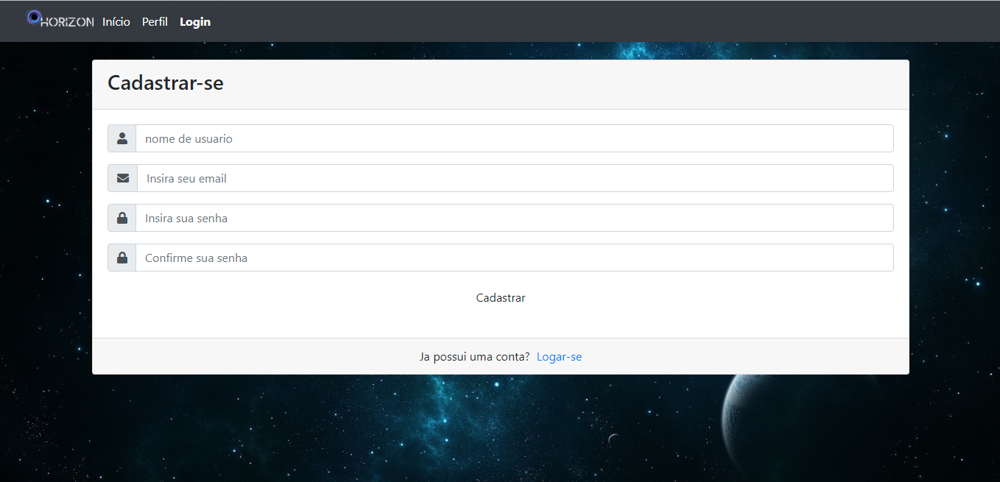
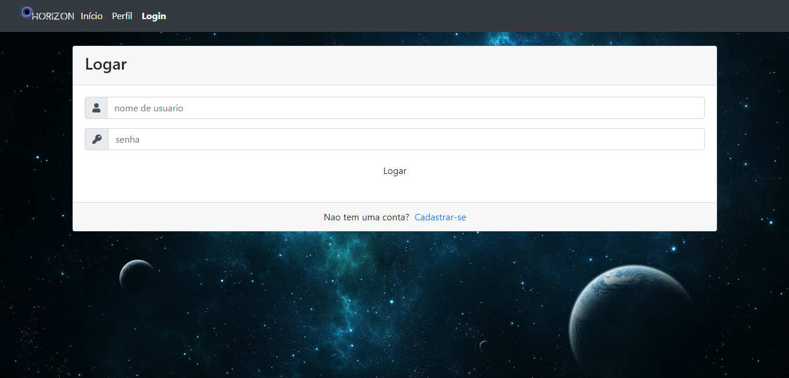
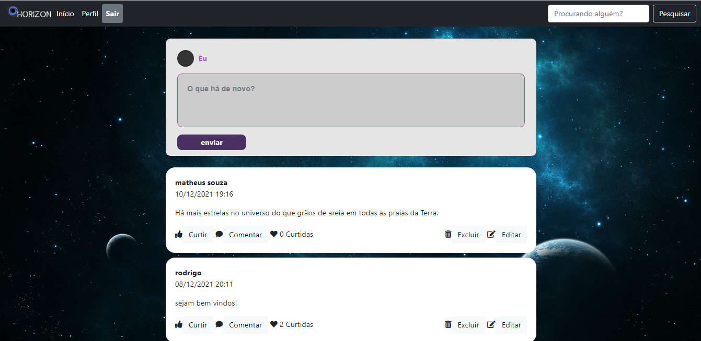
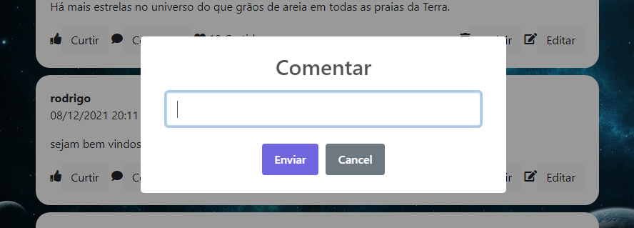
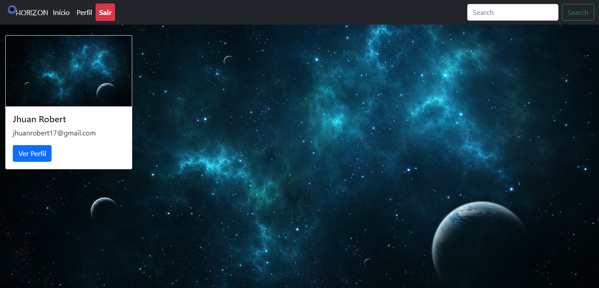
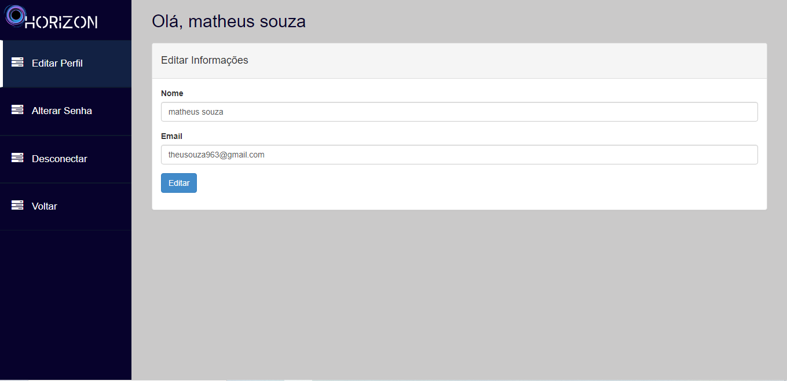
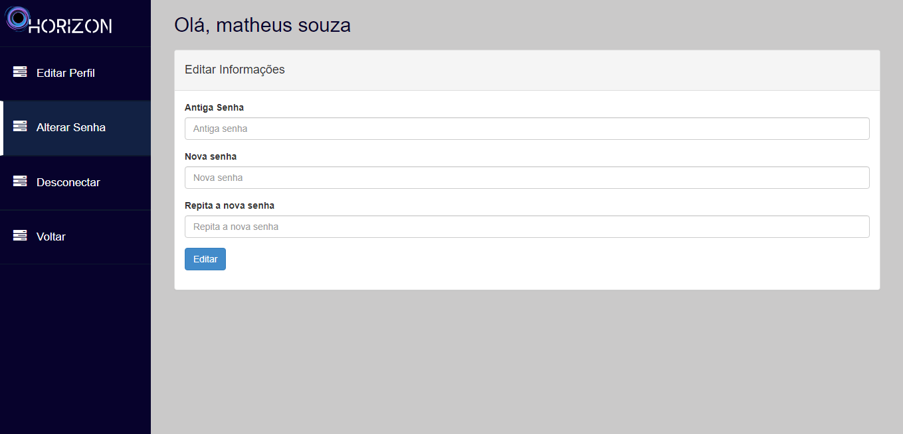

# Manual do Usuário

 Neste espaço é onde faremos um tour detalhado pelas diversas interfaces de nosso sistema, demonstrando as funções das mesmas enquanto passamos por elas.

**Lista das Funcionalidades:**

 - [Cadastro](#Tela-de-Cadastro)
 - [Login](#Tela-de-Login)
 - [Timeline](#Timeline)
 - [Buscas](#Resultados-da-Busca)
 - [Opções de Perfil](#Opções_de_Perfil)
 

## Tela de Cadastro
 
 Esta é, como o nome sugere, a tela que receberá você e outros usuários novos ao sistema, aqui vemos os campos para inserir as informações que formarão sua conta (O nome de usuário, o e-mail, a senha e o campo para confirmar a senha), assim como o botão que deverá ser pressionado após o preenchimento para completar o cadastro e registrar os dados no sistema e a opção para ir direto à tela de login, caso você já esteja cadastrado.

## Tela de Login
 
 Esta é a tela para onde serão mandados os usuários que já estão cadastrados no site, para que os mesmos possam acessar suas contas, aqui vemos os campos de texto onde devem ser inseridas as informações da conta em questão (Nome de usuário e senha), para que se seja concedido o acesso, assim como um botão que deverá ser pressionado após o preenchimento para completar o processo e a opção de retornar a tela de cadastro, caso não se tenha uma conta.
 
## Timeline
 
 Esta é a tela principal do nosso sistema, aqui vemos uma multitude de opções e funcionalidades, bem mais que nas telas anteriores, estão presentes nesta tela:
 - A área dedicada para se fazer postagens, com um botão para se resgistrar a postagem após inserir o texto.
 - As postagens feitas por outros usuários, com as opções de like, dislike e comentário, cada uma com um botão próprio.
 Ao se escolher a opção de comentar, abre-se um formulário com uma caixa de texto para se inserir o comenta em sí e um botão para registrá-lo.
 
 - Na navbar agora se faz presente uma barra de busca, para que se possa procurar por outros usuários, com um botão para realizar a busca do lado. 
 - Também está presente na navbar a opção de "Perfil", que leva o usuário à uma nova tela com opções relativas ao próprio perfil.

## Resultados da Busca
 
 Esta é a tela que você verá após realizar uma busca, aqui estão presentes os resultados da sua busca, os usuários encontrados e, em cada um deles, um botão que lhe dá a opção de visitar o perfil desses usuários.

## Opções de Perfil
 Ao se escolher a opção de "perfil" na navbar, você será redirecionado para esta página com algumas outras opções relacionadas ao seu perfil. Estas são:
 - "Editar Perfil" lhe permite alterar o seu nome de usuário e o seu e-mail, com campos de texto para a inserção de novos e um botão para confirmar.
 
 - "Alterar Senha" como o nome sugere, é um espaço dedicado ao gerenciamento da sua senha. Para criar uma nova, simplesmente insira a antiga no campo indicado, a nova logo embaixo e confirme a nova, logo após, pressione o botão "Editar" para confirmar a mudança.
 
 - "Desconectar" obviamente lhe desconectará de sua conta atual e, em seguida, o levará de volta à tela de login.
 
 - "Voltar" te levará de volta à timeline.
 
 
